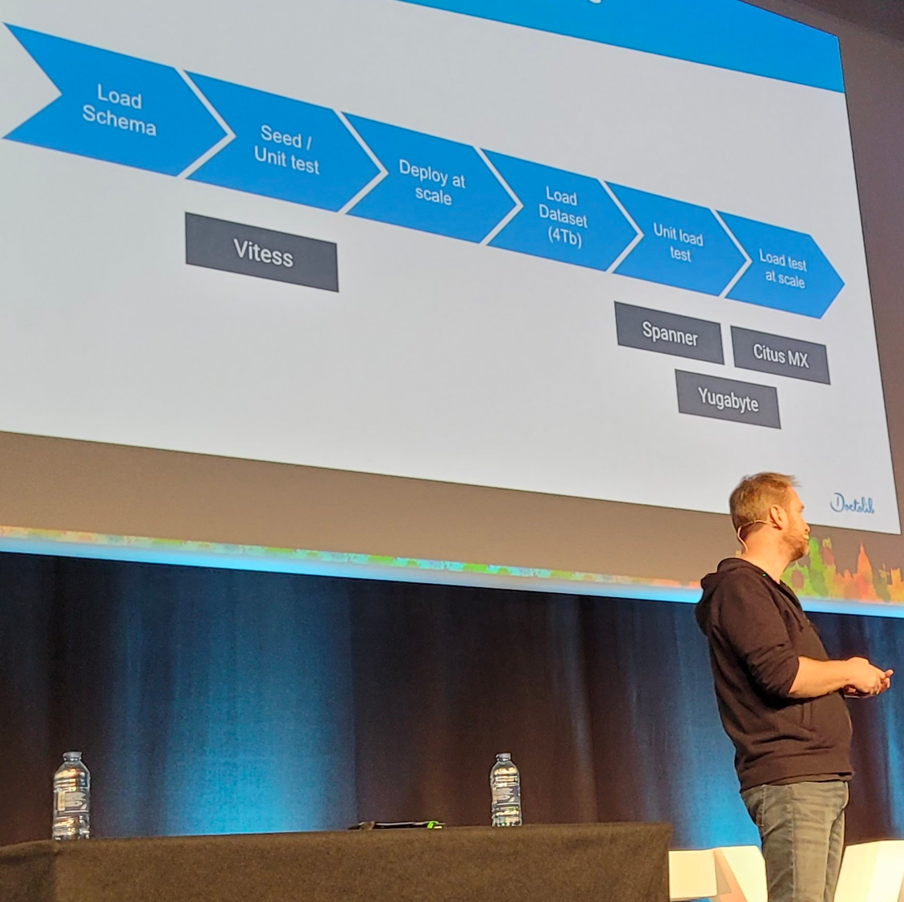

# Doctolib a besoin d'une base de données plus puissante. Ok, mais laquelle?

Talk : https://cfp.devoxx.fr/2022/talk/KCB-5237/Doctolib_a_besoin_d'une_base_de_donnees_plus_puissante._Ok,_mais_laquelle%3F

Monolith doctolib en ruby on rails

Leur stratégie résumé : "Rien changer tout de suite si le mur est dans 6 mois"

### Plan A : switch to a bigger datbase

Candidats :
- Spanner
- Yugabyte
- Citus MX
- Vitess

Aucun des 4 n'a survécu au test

Ils souhaitaient obtenir *10 et pas un simple *2

Trop dur de migrer leur base Postgres vers une autre

Citus qui est basé sur du Postgres a été la plus loin.

### Plan B : split the database 
Ils vont split leur mono base (500 tables, 25 TB) en plusieurs