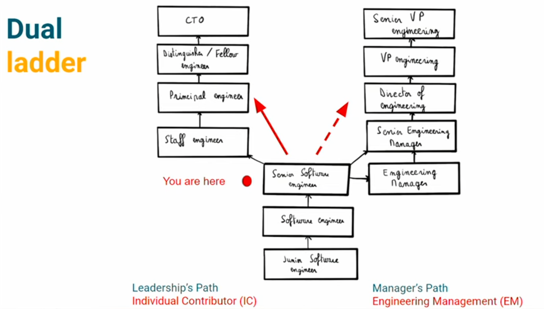

# Développ(eur|euse) Senior avec 6 ans d’expérience, et après ? 

Replay : [https://www.youtube.com/watch?v=X5MYKj1C2qM&list=PLTbQvx84FrAQwUMLVvcZu4DZwS1qGxKyM&index=4&ab_channel=DevoxxFR](https://www.youtube.com/watch?v=X5MYKj1C2qM&list=PLTbQvx84FrAQwUMLVvcZu4DZwS1qGxKyM&index=4&ab_channel=DevoxxFR)

Slides : [https://docs.google.com/presentation/d/1XLf-0PqpHD-M7chcHWpuxCYgd8Ju9sD2rnFY_x9GFBY/edit#slide=id.g11e2cbf4653_0_0](https://docs.google.com/presentation/d/1XLf-0PqpHD-M7chcHWpuxCYgd8Ju9sD2rnFY_x9GFBY/edit#slide=id.g11e2cbf4653_0_0)

Que faire après 6 ans pour rester dans le code et ne pas devenir manager?

The end of the road?

### Engineering lader :
Junior Software Engineer > Software Engineer > Senior Software Engineer



```
Individual -> Junior : "Take this tightly defined feature and built it"
Team squad -> Confirmed : "Take this vaguely defined feature and built it" => Contributeur "positif"
Chapter guilds (communautes de pratiques) -> Senior : "Take this known problem and figure out how to solve it"
Product Line -> Staff Engineer : "Take this goal and find the problem we should be solving"
Company -> Principal : "Observe the compagny and define the goals we should be focusing on" => contribuer OKR, coordoniation de sujets qui nécessite une coordoination technologique (ex. le paiement, l'internationalisation) , anticipation
Industry -> Distinguished / Fellow : "Iterate and start over at the industry level"
```

Individual contribs - Staff/principal/fellow :
```
Kent Beck => TUs Junit / XP xtreme programming
Neha Narkhede => Linkedin (Kafka)
```

How do you create impact?
```
- écouter vos utilisateurs
- mesurer les choses (Gilles chez les Furets)
- se mettre des objectifs
- aligner les gens vers ces objectifs
- itérer
```

Pour progresser un point clef : la COMMUNICATION !

```
PM : partie discovery (value, usability, feasability, visability)
Techs : partie delivery (reliability, security, scalability, perfomance)
```

Framework for leaders (inspired by "feedback framework" from Netflix) :
```
- avoid "us versus them" : we are one team => "le marketing ça va pas, l'équipe front, l'équipe back.." = il y a un PB
- aim to improve
- focus on what is actionable: suggest solutions
- disagree and commit 
```